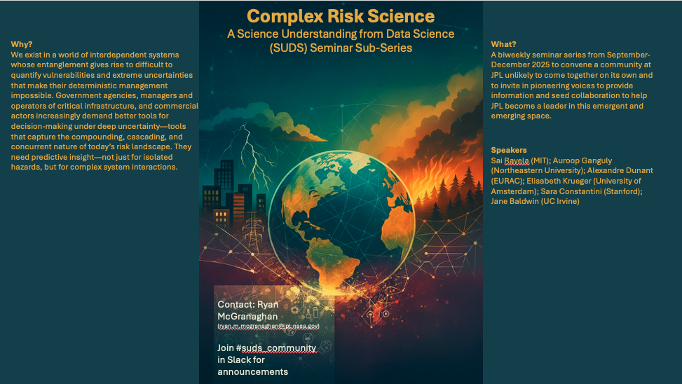

# Description

**Risk science—at the intersection of physical hazards and societal systems—is essential, underdeveloped, and ripe for new insights from complexity and social sciences.**

We exist in a world of interdependent systems [[Helbing, 2013](https://www.nature.com/articles/nature12047)] whose entanglement gives rise to difficult to quantify vulnerabilities [[Vespignani, 2010](https://pdodds.w3.uvm.edu/files/papers/others/2010/vespignani2010a.pdf)] and extreme uncertainties that make their deterministic management impossible. The interdependence of our 21st century world is not merely economic nor solely technological, but extends into the social realm as well [[Beck and Ritter; 1992]](https://www.goodreads.com/en/book/show/134443)]. Complexity science, not a discipline but a paradigm of scientific discovery (e.g., [McGranaghan; [2024]](https://link.springer.com/article/10.1007/s11214-024-01081-2)), has produced a profound shift in scientific thought and concomitant understanding, perhaps most effective in its ability to evolve scientific disciplines toward new foci.
The topic of risk in natural hazards and ecological science remains in its infancy, as are attempts to connect the study of purely physical systems with socio-physical systems. Our modern world requires a more robust science of risk and complexity calls us to a new epistemological engagement: from risk to resilience. An articulated and practicable risk science and resilience paradigm is the principle pathway to the advancement of science to address global (at once intimate and planetary) crises and to connect from scientific understanding to decision-guidance.
Socio-ecological-techological systems (SETS) are the frontier of this paradigm of complex risk and resilience science.

This will be a seminar sub-series, hosted by Ryan McGranaghan at the NASA Jet Propulsion Laboratory, to convene a multi-institutional community, unlikely to come together on its own, of pioneering voices to provide information and seed collaboration in this emergent and emerging space. Each seminar will explore bold yet feasible questions that define this cross-disciplinary, cross-domain community and illuminate the new projects needed to address them.

# Building on...

(a few events)
- [JPL Climate Risk Science Workshop](https://climatesciences.jpl.nasa.gov/events/20241028-workshop/index.html) (October 28 – 30, 2024)
- [The JPL Science Understanding from Data Science (SUDS) Workshop and Conference](https://sudsconf.com/index.html) (which established risk science as a ‘Horizons Initiative’) (August 2024)
- [Workshop on Critical Transitions in Socio-Ecological Systems](https://pcts.princeton.edu/events/2025/critical-transitions-socio-ecological-systems) (February 2025)
- [Boston-Area Complex Risk Science Summit](https://ai.northeastern.edu/event/boston-area-complex-risk-science-exploring-new-frontiers-and-a-new-community-for-understanding-risk) (June 2025)

# Building toward...

- Embedded discussions (intra-institutional, cross-disciplinary)
After the JPL Science Understanding from Data Science Initiative there was interest to create new forums for data scientists and physical scientists to find one another. The most common form of the ‘embedded discussion’ is to have data scientists sit with a physical science group during their group meeting to build the connections between them, understanding the science questions that exist and mapping to data science solutions.

- Analysis Working Groups (cross-institutional)
The solution to building capacity and collectivity for risk science that responds to the risk landscape that is integrally and irreversibly affected by interconnectedness of systems and hazards is to organize ‘analysis working groups’ (AWGs). Pioneered by Sylvain Costes at NASA Ames for the global Biological and Physical Sciences community, AWGs are forums for research interactions around a shared dataset or datasets and for creating FAIR risk science resources to improve risk science understanding and disaster risk reduction. All risk science data are priceless planetary resources that all should be able to access and should serve as grounds for connecting across groups (emphasis is on bridging), and their curation is a challenge. The purposes of the AWGs are to make FAIR risk science resources (datasets, processing pipelines, metadata, notebooks, etc.) and processes for improving open science of them; collaborate among participants to mine-reuse cleaned data to conduct scientific analysis, forming connections that would otherwise not happen

- Complex Risk Science Summit (Spring/Summer 2026)
Our world is increasingly shaped by complex, interconnected risks (hazard likelihood * exposure * vulnerability). Natural hazards do not occur in isolation—they interact with one another, social systems, infrastructures, and ecological processes in nonlinear and often surprising ways. Recent events such as widespread power outages during extreme heat waves, cascading wildfire and air quality crises, and compound weather-space weather disturbances underscore the urgency of advancing beyond siloed risk assessment. Yet the tools available to decision-makers remain inadequate: most current models are hazard-specific, static, and ill-suited to capture compounding and cascading interactions under deep uncertainty. This gap is both a scientific imperative and a strategic opportunity. JPL, with its leadership in Earth observation, digital twins, and AI-enabled modeling, is uniquely positioned to convene the scientific and operational communities needed to define a new paradigm of complex risk and resilience science. We propose to help make JPL the convener of this new cross-disciplinary collective dedicated to advancing the science of complex risk and resilience through a two-day 'Complex Risk Science Summit.'

